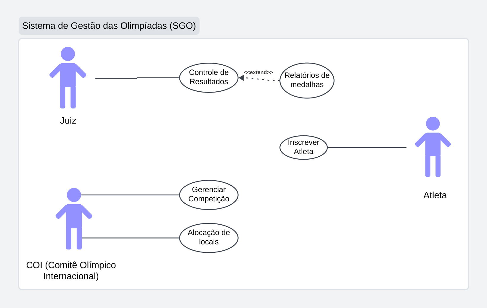
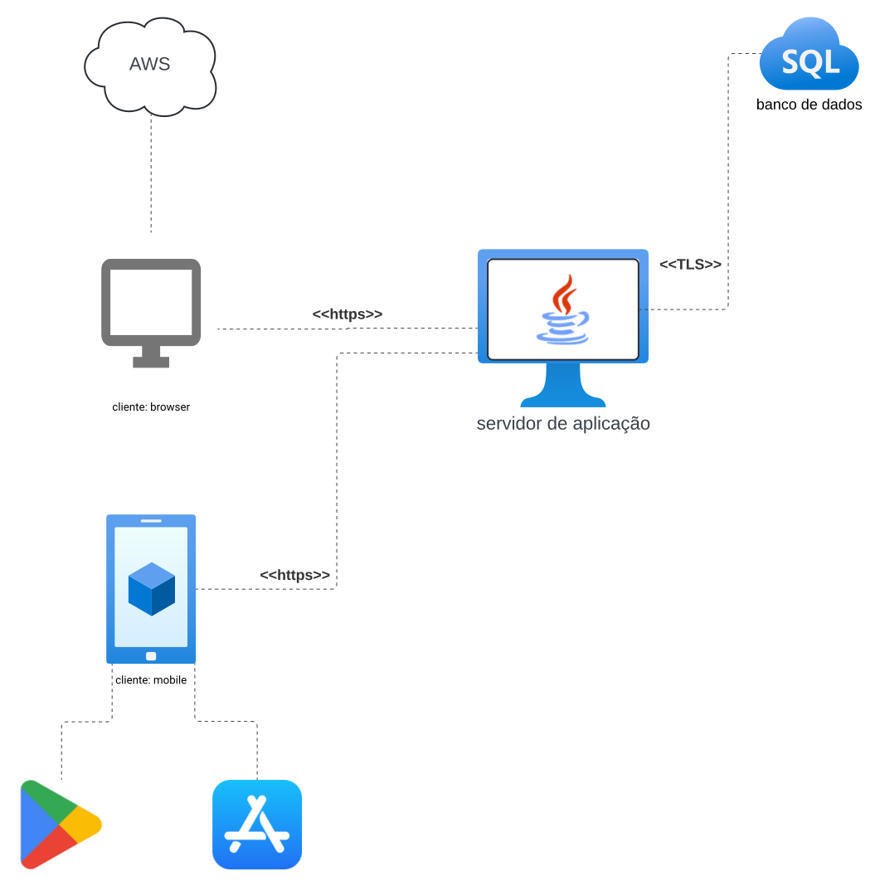
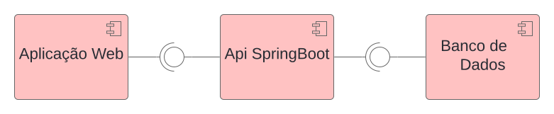
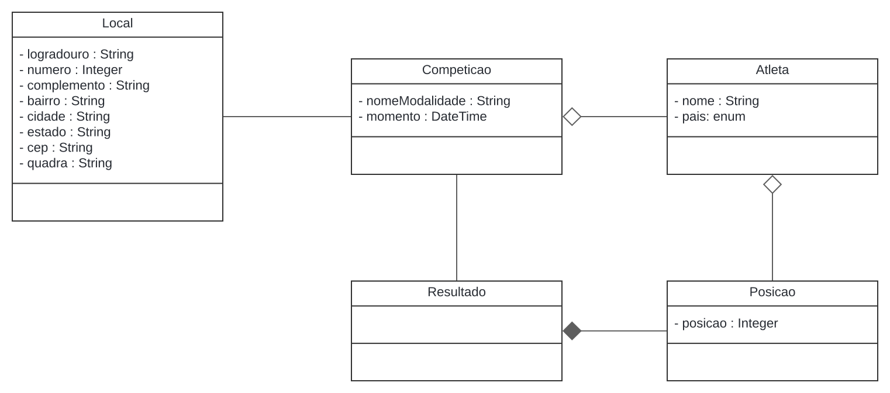

## Historias de Usuario 

### US 01 - Inscrever Atleta 
Eu como **Atleta** \
Quero me inscrever \
Para conseguir ser alocado nas competiçôes 

### US 02 - Gerenciar Competições 
Eu como **COI ( Comite Olimpico Internacional )** \
Quero gerenciar as competições \
para que eu consiga definir os competidores, as regras, paises e consiga cancelar ou alterar devido alguma necessidade  

### US 03 - Alocação dos locais 
Eu como **COI ( Comite Olimpico Internacional )** \
Quero controlar a alocação de locais dos eventos \
para que eu consiga definir em que estadio e em que horario cada evento ira acontecer 

### US 04 - Controle de Resultados 
Eu Como **Juiz** \
Quero controlar os resultados \
Para conseguir registrar as colocações e os ganhadores de cada competição 

### US 05 - Relatorio de medalhas
Eu como **Juiz** \
Quero que o sistema gere um relatorio \
Para que possa ser disponibilizado para os torcedores e para o COI os ganhadores de cada evento, e as colocações de cada atleta 

## Diagramas

### Diagrama de Caso de uso

### Diagrama de pacotes

### Diagrama de Implantação

### Diagrama de Componentes

### Diagrama de Classes
